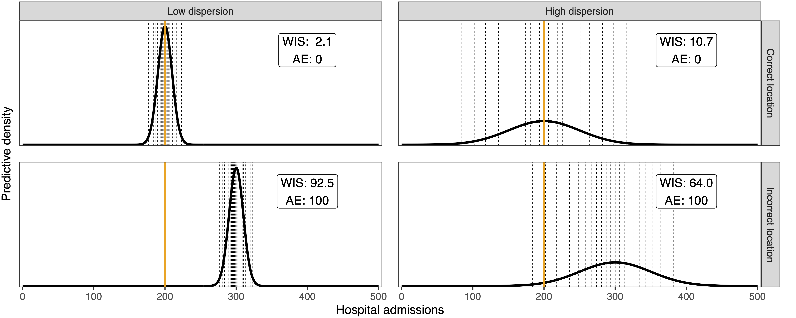
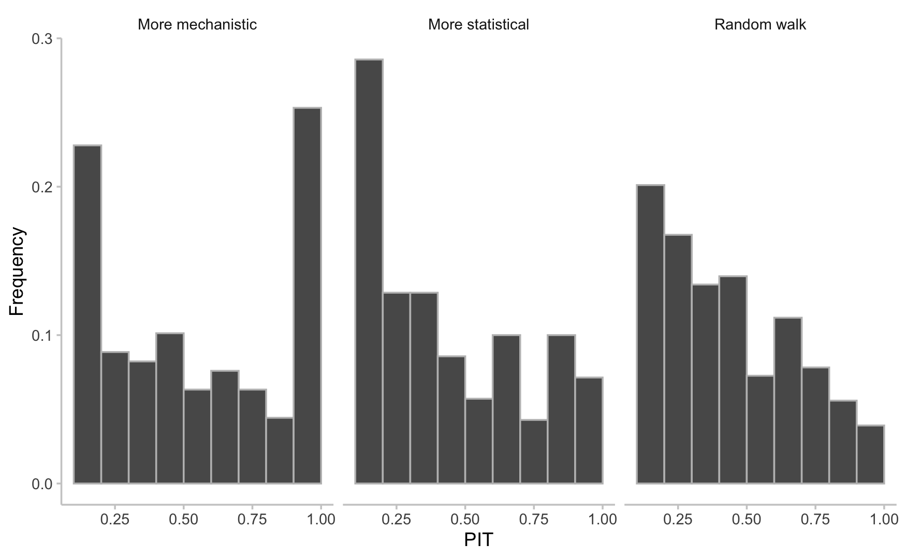

### Aim of this workshop

What is a forecast, and is it any good?

- what **is** a forecast, and how do we visualise it?
- how do we tell whether a forecast is any good? (*evaluation*)
- how do we combine forecasts from several models? (*ensembles*)

# Key takeaways

### Forecasts {.smaller}

- a **forecast** is an unconditional statement about the future
- meaningful forecasts are **probabilistic**
- visualising a forecast means showing the **predictive distribution**, not a single line
- we plot the median with uncertainty intervals against later observed data

### Evaluation {.smaller}

- good forecasts are as **sharp** as possible **subject to being calibrated**
- **proper scoring rules** reward honest probabilistic forecasts
  - the **CRPS** and its quantile form the **WIS** summarise accuracy
- the **PIT** and **coverage** check calibration

### Calibration diagnostics {.smaller}

- a well calibrated forecast has a roughly uniform **PIT** histogram
- systematic bias or over/under-dispersion shows up as departures from uniform
- **coverage** tells us how often observations fall inside stated intervals

### Ensembles {.smaller}

- combining forecasts from several models often **improves predictions**
- ensembles tend to be **better calibrated** and more stable than their members
- simple combinations (mean, median) are a strong baseline

### Feedback {.smaller}

- please tell us if you enjoyed the workshop, what worked / didn't work etc.
- we will send out a survey for feedback

# Thank you for attending!

[Return to the session](../end-of-course-summary-and-discussion)
