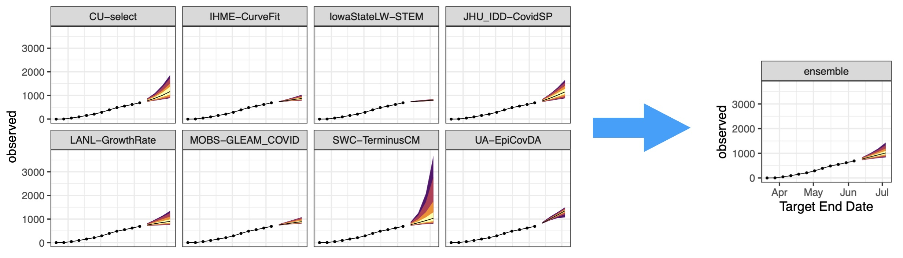
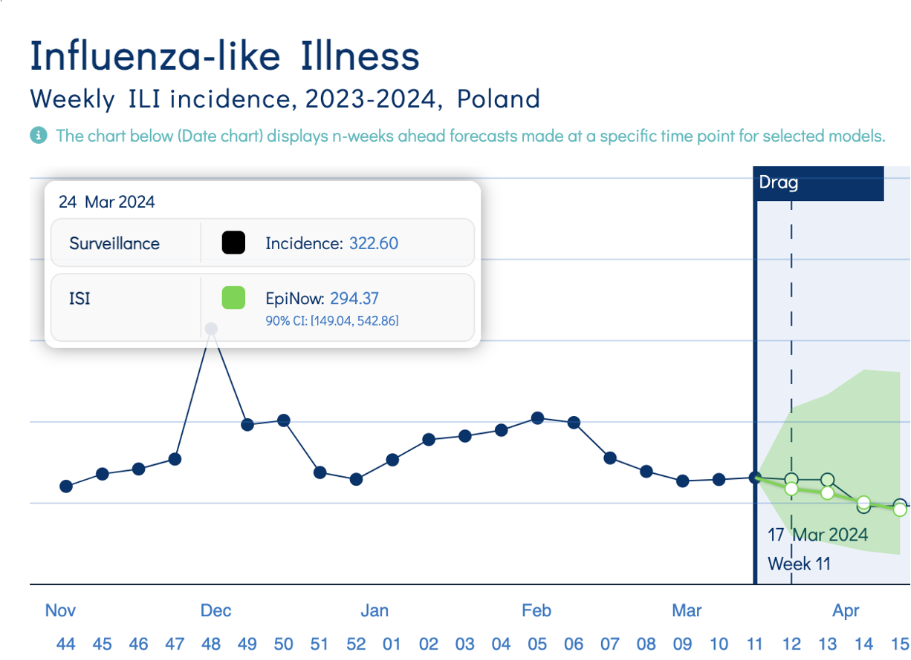
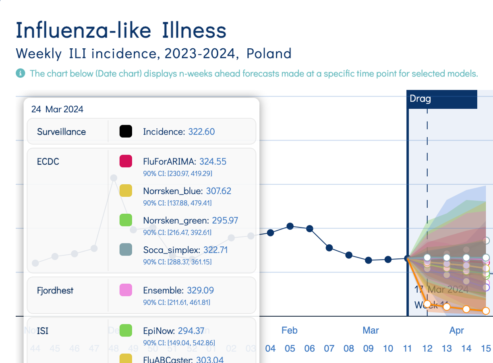
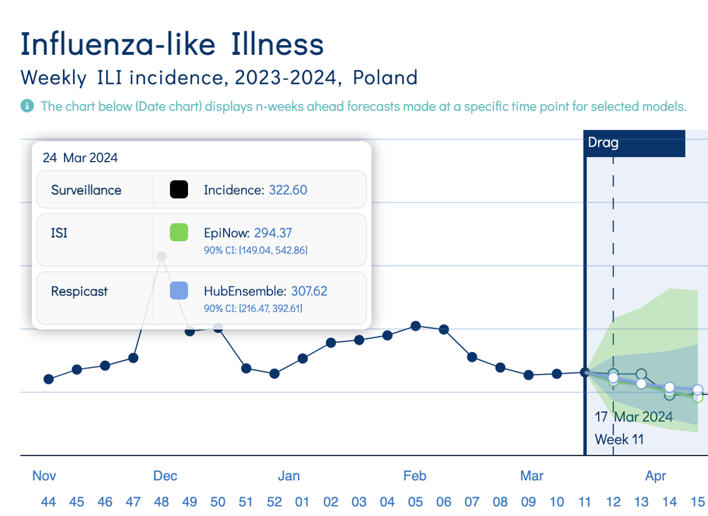
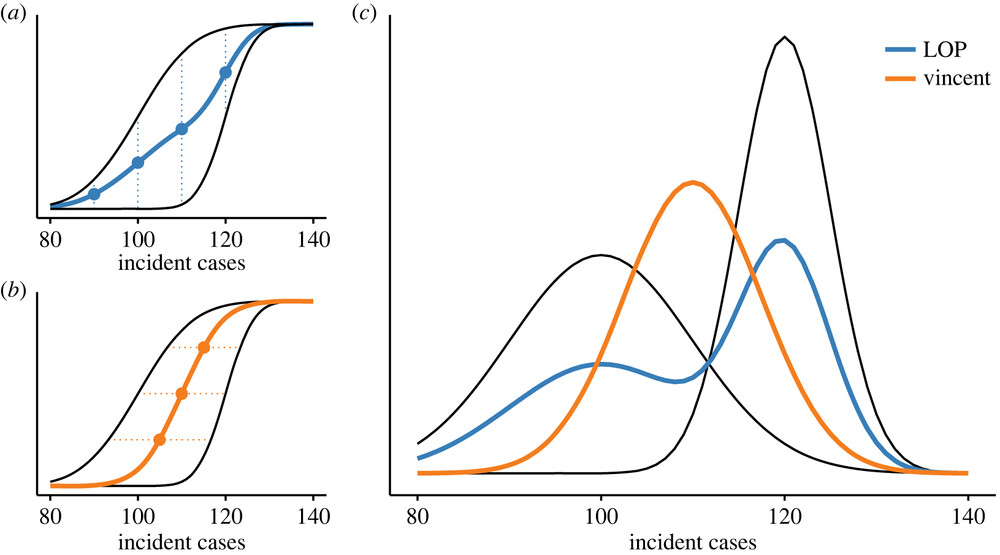
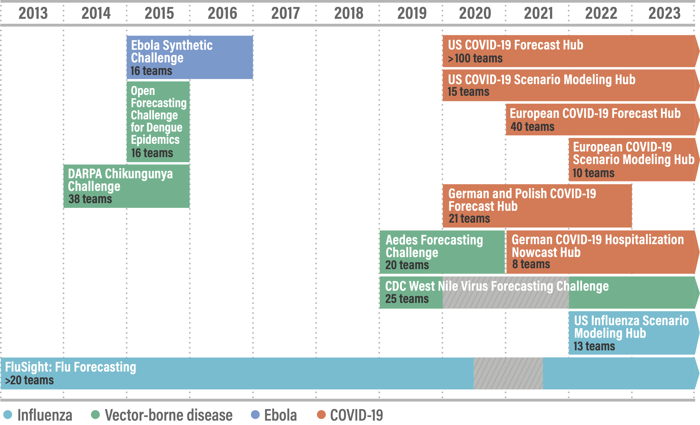

## Ensembles: many forecasts into one

{width="60%" fig-align="center"}

## Why ensemble?

::: {.columns}
::::: {.column width="50%"}
1. Models are specialists and you want all the perspectives
   - different data sources
   - different philosophies, e.g. more mechanistic or more statistical approaches
   - different methodologies and parameterizations
:::::

::::: {.column width="50%"}
{width="100%"}

{width="100%"}
:::::
:::

## Why ensemble?

::: {.columns}
::::: {.column width="50%"}
2. "Whole is greater than sum of parts"
- Average of multiple predictions is often (not always) more performant than any individual model
- Strong evidence in weather & economic forecasting
- Recent evidence in infectious disease forecasting
    - Ebola [@funkAssessingPerformanceRealtime2019]
    - Dengue [@colon-gonzalez_probabilistic_2021]
    - Flu [@reich_accuracy_2019]
    - COVID-19 [@cramer_evaluation_2022]
:::::

::::: {.column width="50%"}
{width="100%"}
:::::
:::

## Ensemble methods: how to combine?

::: {.columns}
::::: {.column width="50%"}
Typically... take the (equal) average!

Combination depends on your view of why models are different:

- Noisy expressions of a single underlying truth?
- Competing uncertainty among multiple plausible hypotheses?
:::::

::::: {.column width="50%"}
{width="100%"}
:::::
:::

## Ensemble methods: unequal weights?

- Can weight models by past forecast performance
  - e.g. using forecast scores

- Rarely better than equal average
  - lots of uncertainty in weight estimation
  - past performance is not guaranteed to predict future performance
    ... put a "strong prior" on equal weights

## Ensembles from multiple modellers 

Collaborative ensembles increasingly used in infectious disease modelling

{width="70%" fig-align="center"}

## Collaborative modelling "hubs"

::: {.columns}
::::: {.column width="50%"}
- Projects run by research groups, public health agencies
- Participation generally open
- Standard format enables
  - data validation
  - ensemble-building
  - model evaluation
  - visualization
:::::

::::: {.column width="50%"}
](figures/hub-modeler-flow.png){width="100%"}
:::::
:::

## Is an ensemble any good?

::: {.columns}
::::: {.column width="50%"}
**Ensemble as a product**

- typically reliable performance benefit over single model
- creates a single product for downstream forecast users 
:::::

::::: {.column width="50%"}
**Ensemble as a process**

- principled approach to model comparison and synthesis
- opportunity for modeller challenge, consensus, and shared responsibility for outputs [@medleyConsensusEvidenceRole2022a]
:::::
:::

## `r fontawesome::fa("laptop-code", "white")` Your Turn {background-color="#447099" transition="fade-in"}

1. Create unweighted and weighted ensembles from multiple models.
2. Evaluate the ensembles against their constituent models.
3. Consider when an ensemble is any good, and for whom.

#

[Return to the session](../forecast-ensembles)

## References

::: {#refs}
:::
