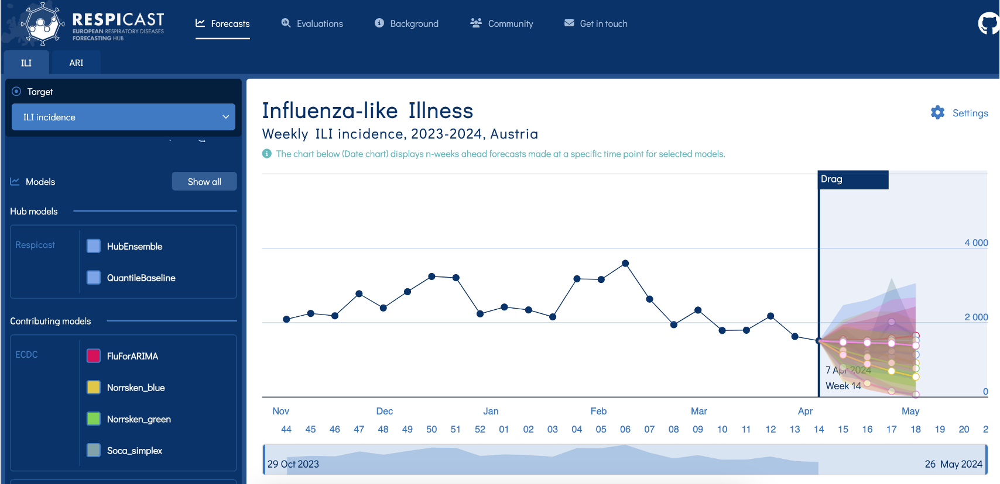

## Ensembles: many forecasts into one

## Why ensemble?

::: {.fragment .fade-in}
1. Models are specialists and you want all the perspectives
    - different data sources
    - different philosophies, e.g. more mechanistic or more statistical approaches
    - different methodologies and parameterizations
:::

::: {.fragment .fade-in}
2. A single "consensus forecast" is easier for decision-makers to digest 
:::

## "Whole is greater than sum of parts"

Average of multiple predictions is often (not always) more performant than any individual model

- Strong evidence in weather & economic forecasting

- Recent evidence in infectious disease forecasting
    - Ebola[@funkAssessingPerformanceRealtime2019]
    - dengue[@colon-gonzalez_probabilistic_2021]
    - flu[@reich_accuracy_2019]
    - COVID-19[@cramer_evaluation_2022]

## Ensemble methods: how to average?

## Ensemble methods: to weight or not?

   - Weight models by past forecast performance
   
      - e.g. using forecast scores
      
   - Rarely better than equal average
   
      - lots of uncertainty in weight estimation!
      - put a "strong prior" on equal weights, both in your mental and statistical models

## Collaborative modelling "hubs"

:::: {.columns}

::: {.column width="50%"}
- Projects run by research groups, public health agencies

- Participation generally open
   
- Standard format enables 
  - data validation
  - ensemble-building
  - model evaluation
  - visualization
::: 

::: {.column width="50%"}

](figures/hub-modeler-flow.png)

:::

::::

## Hubs increasingly used in infectious disease modelling

## ... e.g., the European [Respicast Hub](https://respicast.ecdc.europa.eu/) {.smaller}

## Single model {.smaller}

## ... Multiple models {.smaller}

## ... ... Multi-model ensemble {.smaller}

## The politics of ensembles: output vs process

:::: {.columns}

::: {.column width="50%"}
**Hubs: ensemble-as-output**

- value is the *product*
- standardised, validated, comparable
- a forecast you can score and hand over
:::

::: {.column width="50%"}
**Consensus (e.g. SPI-M): ensemble-as-process**

- value is the *process* of agreeing[@medley2022]
- deliberation, challenge, shared ownership
- one message the room stands behind
:::

::::

::: {.fragment .fade-in}
Which would you want going to a minister? Which would you want to *build*?
:::

## When is more more, or less?

Adding a model has a **cost** and a **marginal value**

- gains from ensembling are real but **modest** and context-dependent
- simple averaging is hard to beat: the *forecast combination puzzle*
- **diminishing returns**: it depends on how *independent* the models really are

::: {.fragment .fade-in}
"Is it any good?" is wider than a score: **trust, process, communication** count too
:::

## `r fontawesome::fa("laptop-code", "white")` Your Turn {background-color="#447099" transition="fade-in"}

1. Create unweighted and weighted ensembles from multiple models.
2. Evaluate the ensembles against their constituent models.
3. Debate whether "more" modelling is worth it, and for whom.

#

[Return to the session](../forecast-ensembles)

## References

::: {#refs}
:::

